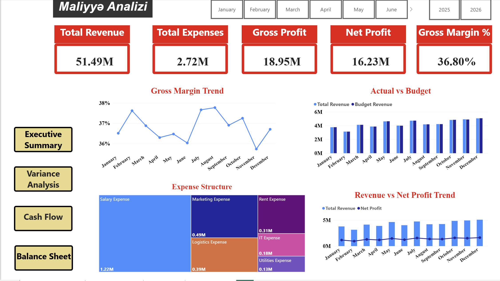
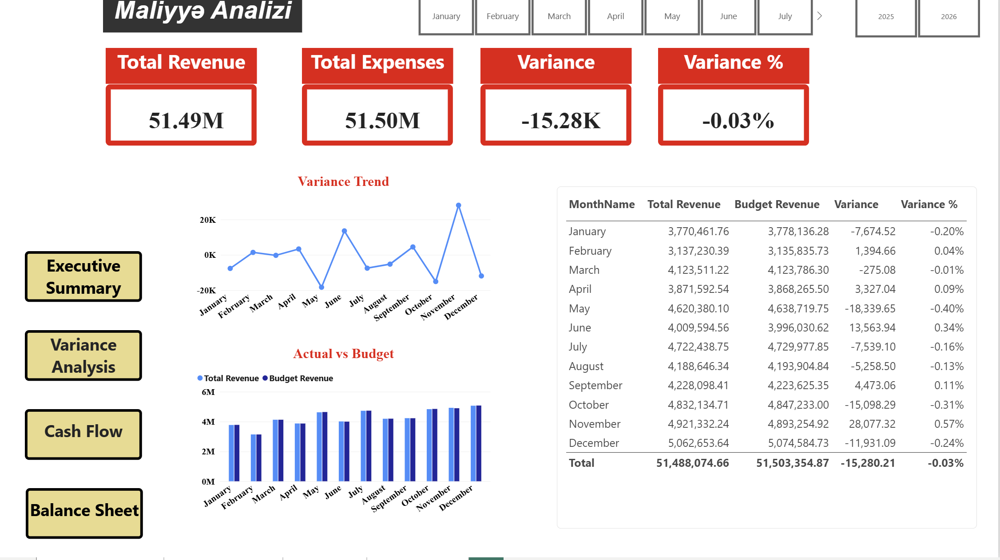
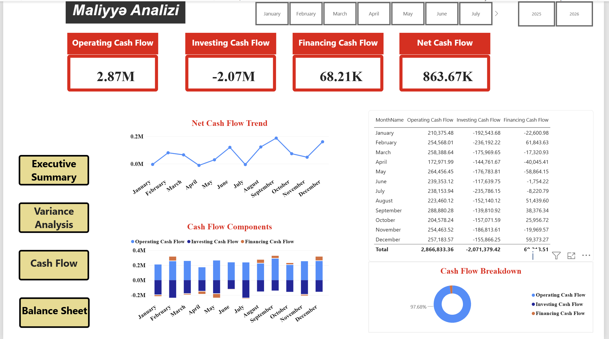
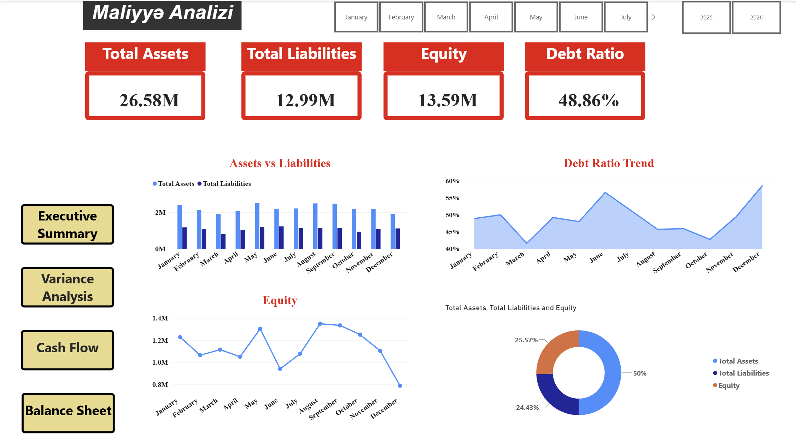

# Financial Analysis Dashboard

## Overview

Interactive financial analysis and reporting dashboard developed using Microsoft Power BI.

## Dashboard Pages

- Executive Summary
- Variance Analysis
- Cash Flow
- Balance Sheet

## Key Features

- Revenue, Expenses and Profit analysis
- Gross Profit and Net Profit tracking
- Gross Margin % analysis
- Budget vs Actual Variance analysis
- Cash Flow analysis
- Assets, Liabilities and Equity analysis
- Interactive filters and slicers
- KPI cards and data visualizations

## Tools & Technologies

- Microsoft Power BI
- DAX
- Power Query

## Dashboard Preview

### Executive Summary

### Variance Analysis

### Cash Flow

### Balance Sheet

